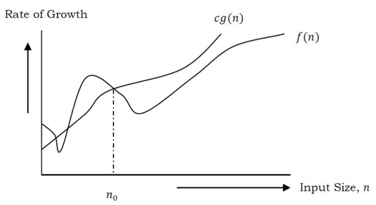
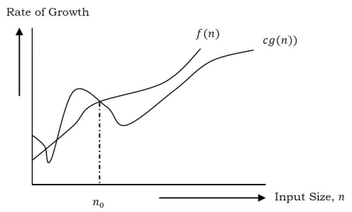
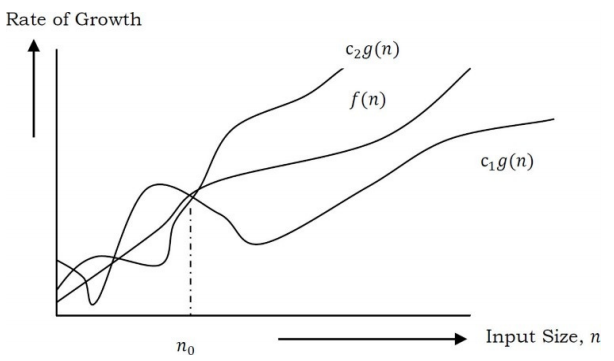

# Chapter 1: Introduction

This chapter explains the importance of the analysis of algorithms, their notations and relationships.

## Variables
These are basically boxes that hold values in them. Or these are placeholders for actual data.

## Data Types
Data types as the name suggests, are the type of data that are predefined in a programming language.
For example: integer, floating point, character, string (group of characters) etc.
Each data type takes a fixed amount of computer memory. For example integer (depends on the compiler) takes 2 bytes (16  bits), float takes 4 byts (32 bits) and so on. 

At the top level, there are two types of data types:
- System-defined data types (Premitive data types)
- User-defined data types

### System-defined data types (Primitive data types)
These are the data types that are defined by the system. The very common data types that are provided by many programming languages are: int, float, char, double, bool, etc. 
The memory allocated for each primitive data type depends on the programming language, the compiler and the operating system.

### User defined data types
Most programming languages allow userd to define their own data types and these are called user defined data types.
For example, structures in C/C++ and classes in Java.

Below is an example of user defined data type (struct) in C. This gives more flexibility and comfort in dealing with computer memory.
```c 
struct newType{
    int data1;
    fload data2;
    chat data;
};
```

## Data Structures
Okay so now we have data. But we need a way to store and organize it in a way so that it can be used efficiently and `data structure` is that way!

> A data structure is a special format for organizing and storing data.

General data structure types include: arrays, files, linked lists, stacks, queues, trees, graphs and so on.

Depending on the organizations of the elements, data structures can be classified into two types:
1. Linear data structures: ELements are *accessed* in a sequential order (not compulsory to store sequentially). eg: LInked Lists, Stacks and Queues.
2. Non-Linear data structures: Elements of this data structures are stores/accessed in a non-linear order. Examples: Trees and graphs.

## Abstract Data Types (ADTs)
Data Stuctures with their operations combined is called Abstract Data Types (ADTs). So ADT consists of two parts:

1. Declaration of data.
2. Declaration of operations.

Commonly used ADTs include: Linked Lists, Stacks, Queues, Priority Queues, Binary Trees, Dictionaries, Disjoint Sets (Union Find), Hash Tables, Graphs, and many others.

For example, stack uses LIFO (Last-In-First-Out) mechanism while storing data. The last element inserted into the stack is the first element that gets deleted. Common operations on stack: Creations, pushing element to stack, popping element from the stack, finding the current top of the stack, finding number of elements in the stack, etc.

## What is an Algorithm?
An algorithm is a step by step **unambiguous** instructions to solve a given problem.
There are two main criteria for judging the merits of algorithms:
- Correctness: does the algorithm give a solution to the problem?
- Efficiency: how much resources (time and memory) does it take to execute?

## Why the Analysis of Algorithms?
This helps us to determine which algorithm is most efficient in terms of time and space consumed.

## What is Running Time Analysis?
It is the process of determining how processing time increases as the size of the problem (input size) increases. The input size is the number of elements in the input.
The following are the common type of inputs:
- Size of an array.
- Polynomial degree
- Number of elements in a matrix
- Number of bits in a binary representation of the input
- Vertices and edges in a graph.

## How to Compare Algorithms
To compare algorithms, let us define a few objective measures:

**Execution times?** Not a good measure as these are specific to a particular computer.

**Number of statements executed?** Not a good measure, since the number of statements varies with the programming language as well as style of indicidual programmer.

**Ideal solution?** Let us assume that we express the running time of a given algorithm as a function of the input size n (i.e., *f*(n)) and compare these different functions corresponding to running time. This kind of comparison is independent of machine time, programming style, etc.

## What is Rate of Growth?
The rate at which the running time increases as a function of input is called rate of growth.
Let us assume that you go to a shot to buy a car and a bicycle. If someone asks you what are you buying? You'd say you are buying a car (in general), just because cost of car is much more than the bicycle.

We can represent the cost of car and bicycle as functions(f(n)) and neglect those that are insignificant (for larger values of n). As an example, in the case below, n<sup>4</sup>, 2n<sup>2</sup>, 100n and 500 are individual costs of some function and approximate to n<sup>4</sup> since n<sup>4</sup>is the highest rate of growth.

> n<sup>4</sup> + 2n<sup>2</sup> + 100n + 500 = n<sup>4</sup>

## Commonly Used Rates of Growth
| Time Complexity | Name               | Example                                             |
| :-------------: | ------------------ | --------------------------------------------------- |
|        1        | Constant           | Adding an element to the front of a linked list.    |
|        n        | Logarithmic        | Finding element in a sorted array                   |
|      nlogn      | Linear             | Finding element in an unsorted array                |
|      logn       | Linear Logarithmic | Sorting n items by 'divide and conquer' - Mergesort |
|  n<sup>2</sup>  | Quadratic          | Shortest path between two nodes in a graph          |
|  n<sup>3</sup>  | Cubic              | Matrix multiplication                               |
|  2<sup>n</sup>  | Exponential        | The Towers of Hanoi problem                         |

## Types of Analysis
We saw that we can express algorithms in form of an expression. That means we represent the algorithm with multiple expressions: one for the case where it takes less time and another for the case where it takes more time.

First one is **The Best case** and the second one is **The worst case**

There are three types of analysis:
- **Worst case**
  - Defines the input for which the algorithm takes a long time (slowest time to complete) 
  - Input is the one for which the algorithm runs the slowest
- **Best case**
  - Defines the input for which the algorithm takes the least time (fastest time to complete).
  - Input is the one for which algorithm runs the fastest.
- **Average case**
  - Provides a prediction about the running time of the algorithm.
  - Run the algorithm many times, using many different inputs that come from some distribution that generates these inputs, compute the total running time (by adding the individual times), and divide by the number of trials.
  - Assumes that the input is random.


> <center>Lower Bound <= Average Time <= Upper Bound</center>

For a given algorithm, we can represent the best, worst and average cases in the form of expressions. As an example, let f(n) be the function which represents the given algorithm.

> f(n) = n<sup>2</sup> + 500, for worst case

> f(n) = n + 100n + 500, for best case


## Asymptotic Notation
Having expressions for thee best, average and worst cases, for all three cases we need to identify the upper and lower bounds. To represent these upper and lower bounds, we need some kind of syntax which we will discuss further.

Let us assume that the given algorithm is represented in the form of function f(n).

## Big-O Notation [Upper Bounding Function]
This notation gives the tight upper bound of the given function. Generally, if it represented as f(n)=O(g(n)). That means, at larger values of n, the upper bound of f(n) is g(n).

For example, if f(n)= n<sup>4</sup> + 100n<sup>2</sup> + 10n + 50 is the given algorithm, then n<sup>4</sup> is g(n).
That means g(n) gives the maximum rate of growth for f(n) at larger values of n.



In details, O-notation is defined as 
> O(g(n)) = {f(n): there exist positive constants c and n<sub>0</sub> such that 0 ≤ f(n) ≤ cg(n) for all n > n<sub>0</sub>}

g(n) is an asymptotic tigh upper bound for f(n). Our objective is to give the smallest rate of growth g(n) which is greater than or equal to the given algorithms' rate of growth/(n). Generally we discard lower values of n. That means the rate of growth at lower values of n is not
important

## Omega-Ω Notation [Lower Bounding Function]
Similar to the O discussion, this notation gives the tighter lower bound of the given algorithm and we represent it as f(n) = Ω(g(n)). That means, at larger values of n, the tighter lower bound of f(n) is g(n). For example, if f(n) = 100n<sup>2</sup> + 10n + 50, g(n) is Ω(n<sup>2</sup>).



The Ω notation can be defined as 
> Ω(g(n)) = {f(n): there exist positive constants c and n<sub>0</sub> such that 0 ≤ cg(n) ≤ f(n) for all n ≥ n<sub>0</sub>}. 

g(n) is an asymptotic tight lower bound for f(n). Our objective is to give the largest rate of growth g(n) which is less than or equal to the given algorithm’s rate of growth f(n).

## Theta-Θ Notation [Order Function]


This notation decides whether the upper and lower bounds of a given function (algorithm) are the same. The average running time of an algorithm is always between the lower bound and the upper bound. If the upper bound (O) and lower bound (Ω) give the same result, then the Θ notation will also have the same rate of growth. As a result, the average case will also be the same. For a given function (algorithm), if the rates of growth (bounds) for O and Ω are not the same, then the rate of growth for the Θ case may not be the same. In this case, we need to consider all possible time complexities and take the average of those

It is defined as 
> Θ(g(n)) = {f(n): there exist positive constants c1 ,c2 and n0 such that 0 ≤ c1g(n) ≤ f(n) ≤ c2g(n) for all n ≥ n0}

## Important Notes 
We generally focus on the upper bound (O) because knowing the lower bound (Ω) of an algorithm is of no practical importance, and we use the Θ notation if the upper bound (O) and lower bound (Ω) are the same.

## Why is it called Asymptotic Analysis?
From the discussion above (for all three notations: worst case, best case, and average case), we can easily understand that, in every case for a given function f(n) we are trying to find another function g(n) which approximates f(n) at higher values of n. That means g(n) is also a curve which approximates f(n) at higher values of n. 

In mathematics we call such a curve an asymptotic curve. In other terms, g(n) is the asymptotic curve for f(n). For this reason, we call algorithm analysis asymptotic analysis.

## Guidelines for Asymptotic Analysis
1. **Loops** 
2. **Nested Loops**
3. **Consecutive Statements**
4. **If-then-else statements**
5. **Logarithmic Complexity**

## Simplyfying properties of asymptotic notations
## Commonly used Logarithms and Summations
## Master Theorem for Divide and Conquer Recurrences
## Divide and Conquer Master Theorem: Problems & Solutions
## Master Theorem for Subtract and Conquer Recurrences
## Variant of Subtraction and Conquer Master Theorem
## Method of Guessing and Confirming
## Amortized Analysis
## Algorithms Analysis: Problems & Solutions
